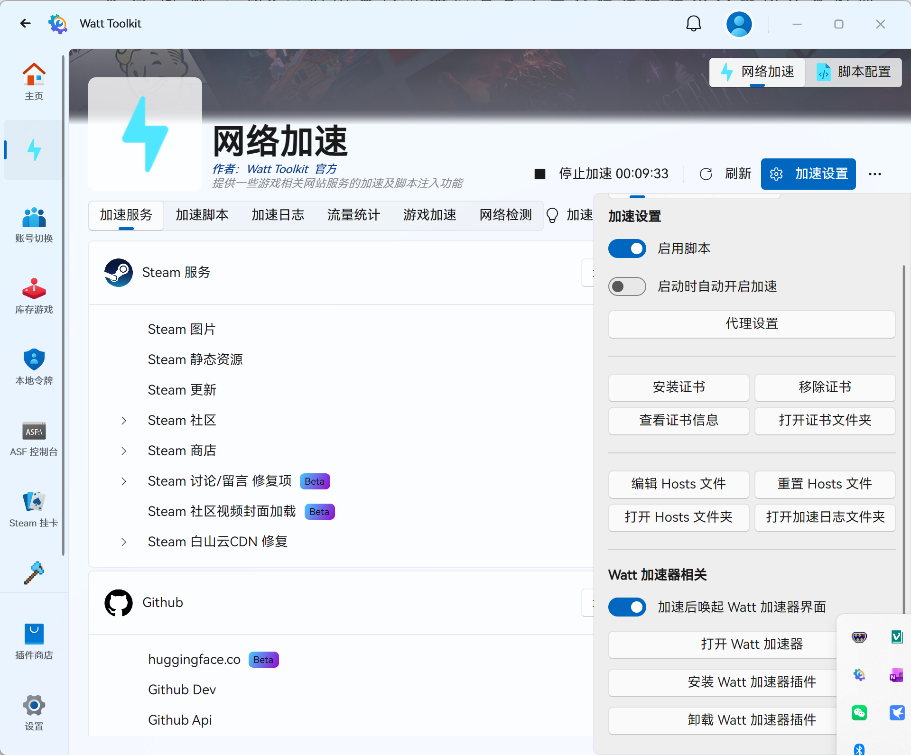
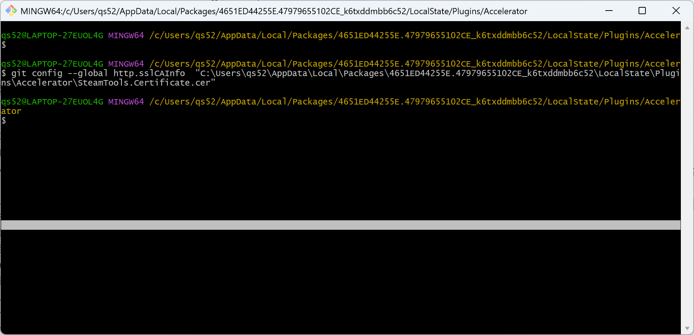

# WattToolkit访问GitHub代码推拉

# 环境：
1. windows 11 64位中文家庭版。
2. Watt Tolkit 代理工具。
3. Visual studio 2022

# 说明

众所周知的原因，从github上同步代码，有时候会失败，网络通信不上。
找到了Watt Tolkit 代理工具解决同步代码的问题。

# 错误信息

1. 不用`Watt Tolkit`代理工具时：
```
正在推送 master
未能推送到远程仓库。请参见输出窗口了解更多详细信息。
发布到远程仓库时遇到错误: Git failed with a fatal error.
unable to access 'https://github.com/xxxxxx/xxxxxx.git/': Recv failure: Connection was reset
```

2. 打开`Watt Tolkit`代理工具时：
```
正在推送 master
未能推送到远程仓库。请参见输出窗口了解更多详细信息。
发布到远程仓库时遇到错误: Git failed with a fatal error.
unable to access 'https://github.com/xxxxxx/xxxxxx.git/': SSL certificate problem: unable to get local issuer certificate
```

# 处理方法
1.在`Watt Tolkit`中"打开证书文件夹”。


2. 在Git中导入` Watt Toolkit `的自签名证书`SteamTools.Certificate.cer`

```
git config --global http.sslCAInfo     "C:\Users\xxxx\AppData\Local\Packages\4651ED44255E.47979655102CE_k6txddmbb6c52\LocalState\Plugins\Accelerator\SteamTools.Certificate.cer"

```


推送正常。

```
正在推送 master
Everything up-to-date
```

[参考这里](https://huayemao.run/posts/265)

备注：
1. 设置些证书后，如果关闭 `Watt Toolkit `,会推送失败，同样报SSL的问题。
2. 会不会影响码云，没有测试。

the end!


