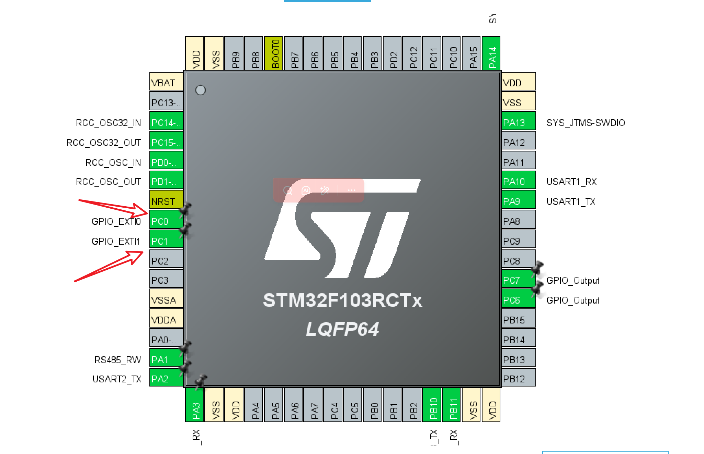
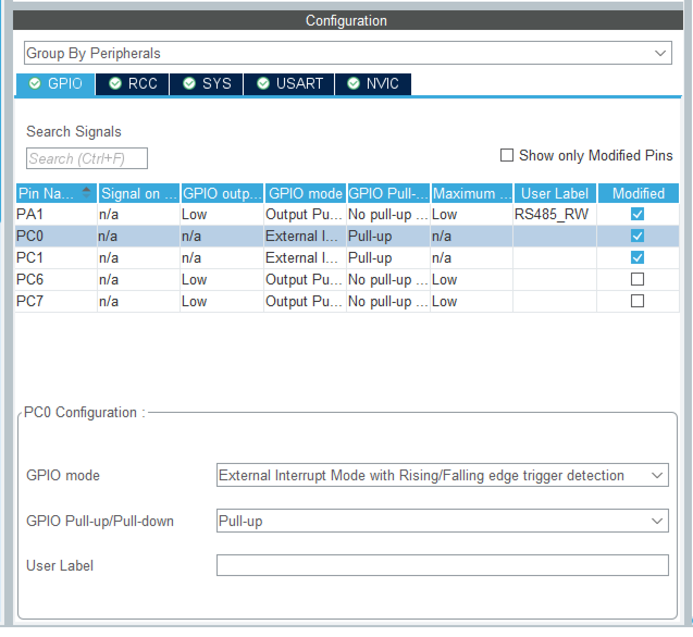
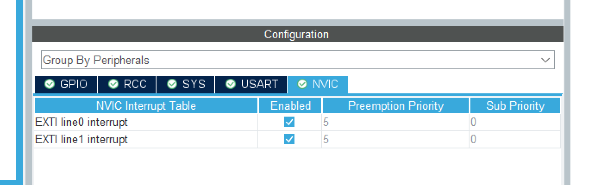

# STM32F103RCT6中断按键消抖，去抖。

## 说明
STM32F103RCT6中断方式，按键消抖，去抖如何实现。

## 环境
1. win11 中文家庭64位。
2. Stm32cubemx 6.15.0
3. keil 5.27


##  Stm32CubeMX 配置

1. 使用的管脚：PC0 和PC1。 两个按键。


2. 管脚内部上拉、上升沿下降沿触发中断。



3. 中断处理函数。


4. 生成代码。


## 代码处理：

打开生成的工程：
在`gpio.c`文件的末尾
```
/* USER CODE BEGIN 2 */
/* USER CODE END 2 */
```
两行注释中间加入以下代码：

```
/* USER CODE BEGIN 2 */

  uint8_t buttonPressed = 0;        // 记录按键的按下状态
  uint32_t buttonPressTime = 0;     // 记录按键按下的时刻
  uint32_t lastFallTime = 0;        // 记录上次下降沿时刻
  uint32_t lastRiseTime = 0;        // 记录上次上升沿时刻

// 按钮中断事件。
void HAL_GPIO_EXTI_Callback(uint16_t GPIO_Pin)
{

		BaseType_t xHigherPriorityTaskWoken = pdFALSE;
	
		if (GPIO_Pin == GPIO_PIN_0)
		{
				uint32_t currentTime = HAL_GetTick();
				if(HAL_GPIO_ReadPin(GPIOC, GPIO_PIN_0) == GPIO_PIN_RESET) // 下降沿，按键按下
				{
					
					// printf("currentTime=%d", currentTime);
					
					// 消抖处理：20ms内只处理一次下降沿
					if(currentTime - lastFallTime > 20)
					{
						buttonPressed = 1;
						buttonPressTime = currentTime;
						lastFallTime = currentTime;

						// 此处添加按键按下操作
						// printf("press down =%d", currentTime);
					}
				}
				else // 上升沿，按键释放
				{
					// 消抖处理：20ms内只处理一次上升沿，且必须之前是按下状态
					if((currentTime - lastRiseTime > 20) && buttonPressed)
					{
						// uint32_t pressDuration = currentTime - buttonPressTime;
						buttonPressed = 0;
						lastRiseTime = currentTime;
												
						// 此处添加按键释放操作
						#if GPIO_DEBUG
						printf("key1 press up =%d", currentTime);
						#endif
						send_msg1_key = MSG_KEY1;
						xQueueSendFromISR(myQueue01Handle, &send_msg1_key, &xHigherPriorityTaskWoken);
					}
				}
		}
		else if (GPIO_Pin == GPIO_PIN_1)
		{
				uint32_t currentTime = HAL_GetTick();
				if(HAL_GPIO_ReadPin(GPIOC, GPIO_PIN_1) == GPIO_PIN_RESET) // 下降沿，按键按下
				{
					// 消抖处理：20ms内只处理一次下降沿
					if(currentTime - lastFallTime > 20)
					{
						buttonPressed = 1;
						buttonPressTime = currentTime;
						lastFallTime = currentTime;
						// 此处添加按键按下操作						
						// printf("press down =%d", currentTime);

					}
				}
				else // 上升沿，按键释放
				{
					// 消抖处理：20ms内只处理一次上升沿，且必须之前是按下状态
					if((currentTime - lastRiseTime > 20) && buttonPressed)
					{
						// uint32_t pressDuration = currentTime - buttonPressTime;
						buttonPressed = 0;
						lastRiseTime = currentTime;
						// 此处添加按键释放操作			
						#if GPIO_DEBUG						
						printf("key2 press up =%d", currentTime);					
						#endif
						send_msg1_key = MSG_KEY2;
						xQueueSendFromISR(myQueue01Handle, &send_msg1_key, &xHigherPriorityTaskWoken);
					}
				}
		}	
}
/* USER CODE END 2 */
```

发生按键事件后，发送队列消息。

[参考文章](https://www.cnblogs.com/artlessist/p/18867089)

完毕。