# VSCODE-CMAKE-STM32CubeMX环境

## 环境：
1. 操作系统 windows 11 家庭中文 64位。
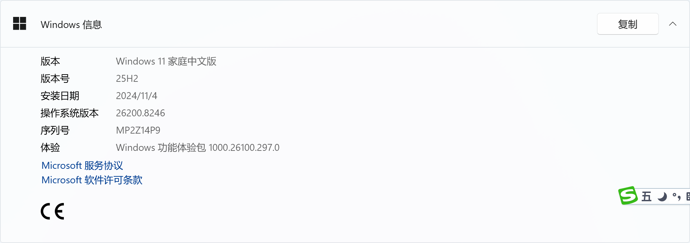

2. VSCode 1.118.1(sytem setup)
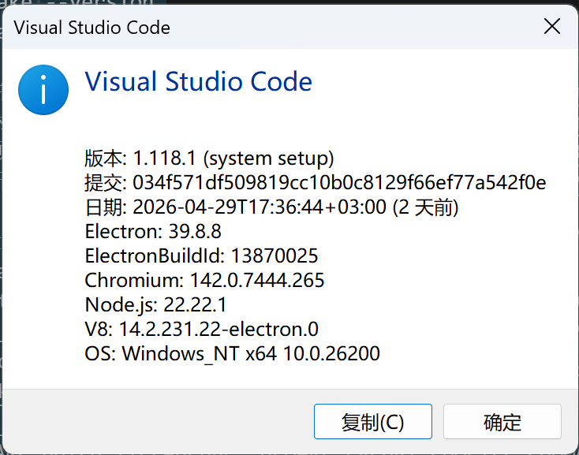


3.  VSCode插件: STM32CubeIDE for Visual Studio Code
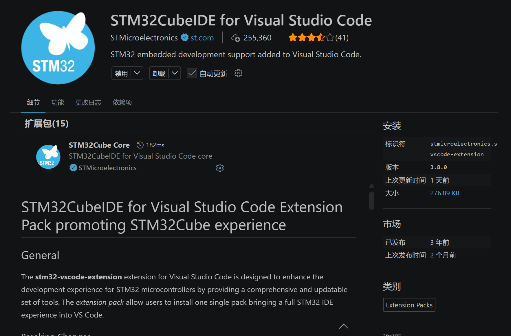

4. STM32CubeMX 6.17.0

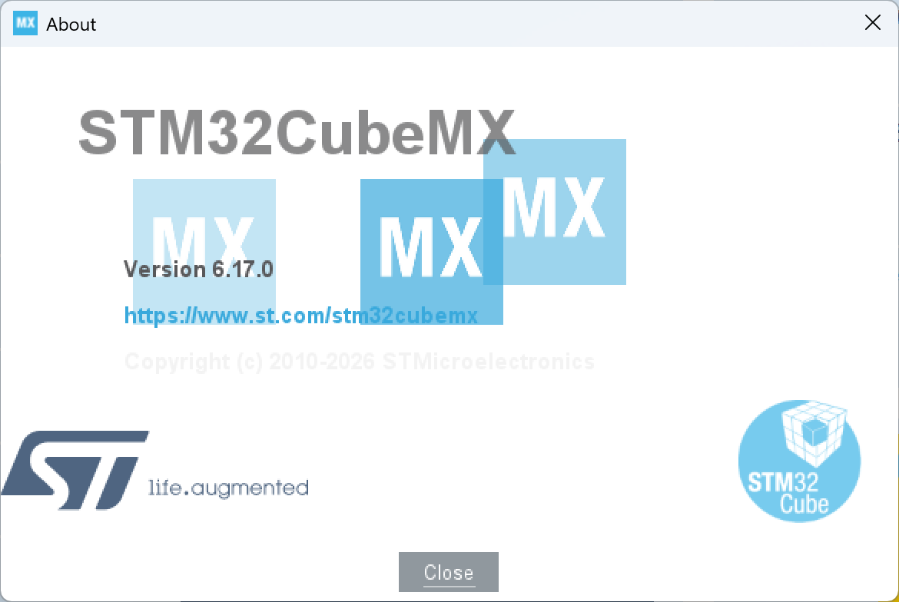


##  STM32CubeMX 生成工程
Toolchain/IDE 选择CMake。
Default Compiler/Linker 选择GCC。
点击“GENERATE CODE”生成工程。

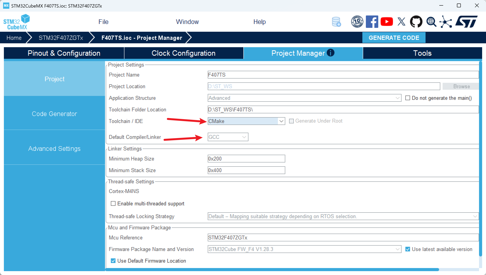


## 使用VSCode 打开生成的工程

打开“文件资源管理器”，找到代码工程目录，在地址样中输入“CMD”
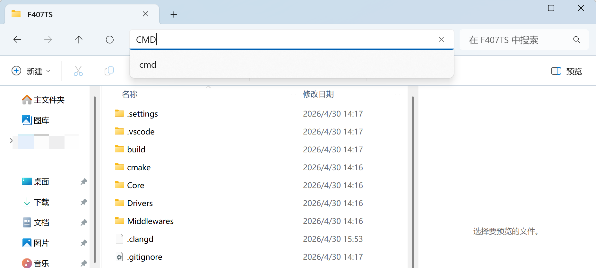


按下回车，打开终端：

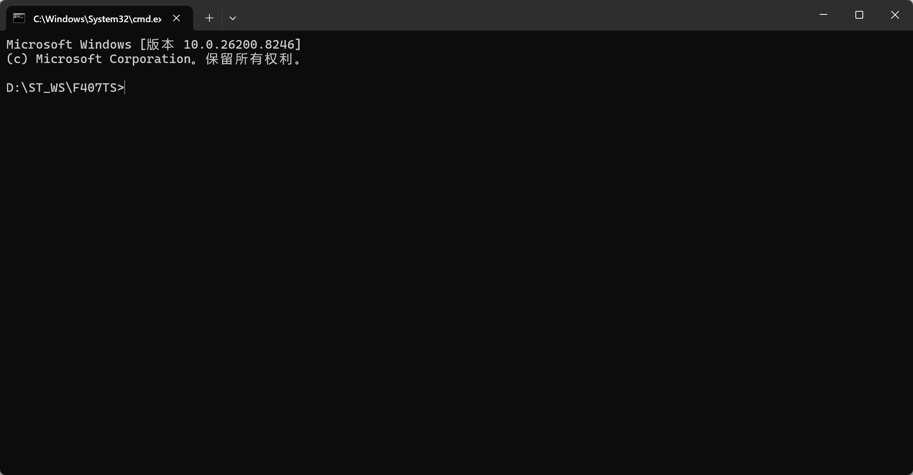

输入`code .`指令

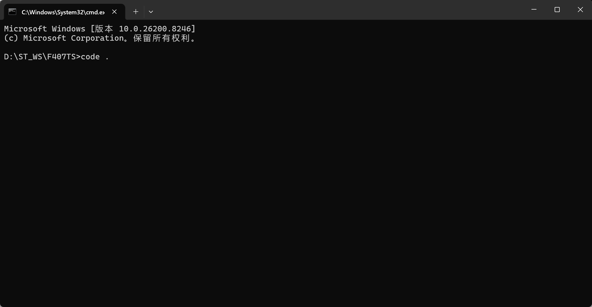

按下回车，打开VSCode。
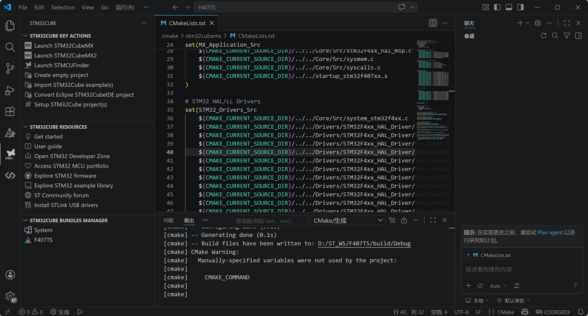
至此，可以进入Coding了。


## 编译工程

1.配置工程。
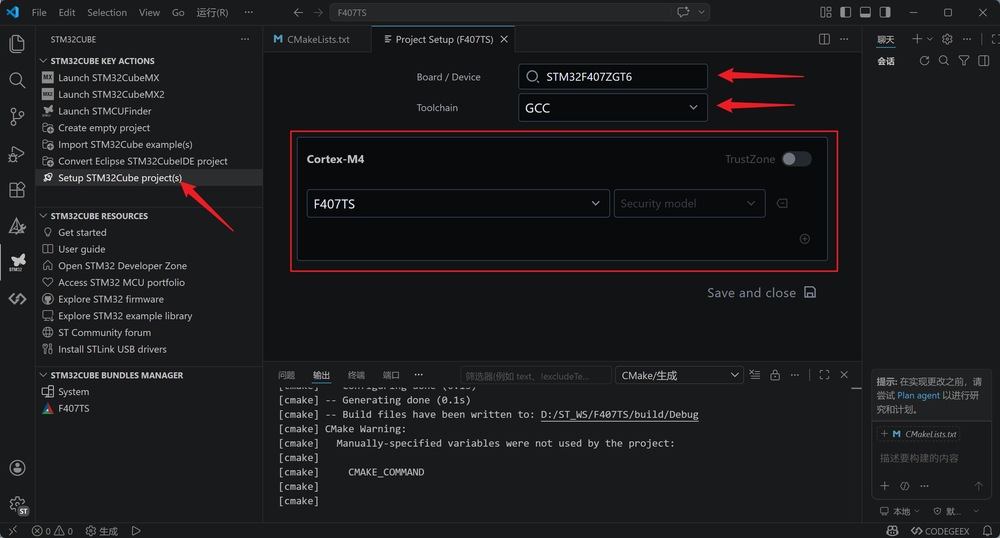
如果方框部分没有出现下拉部分内容，说明环境有问题。
VSCode打开的工程目录，路径太深，同时目录路径别用汉字。
错误的情况：
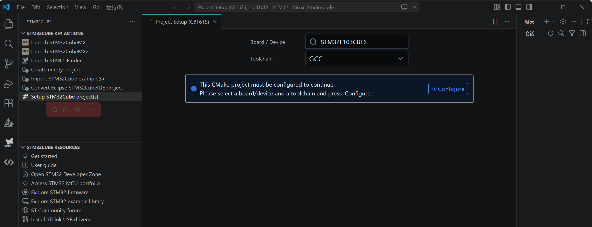
错误信息：
```
This CMake project must be configured to continue.
Please select a board/device and a toolchain and press 'Configure'.
```
编译时的错误信息：
```
[bookmarks] 已加载 0 个书签
[proc] 正在执行命令: cube-cmake --version
[proc] 正在执行命令: cube-cmake -E capabilities
[kit] 已成功从 C:\Users\xxx\AppData\Local\CMakeTools\cmake-tools-kits.json 加载 9 工具包
[presetController] 正在读取并验证预设文件“D:\002XXXXXXXXXXXXXXXXXXXXXXXXXXXcommon\C8T6TS\CMakePresets.json”
[presetController] 已成功针对预设架构验证 D:\002XXXXXXXXXXXXXXXXXXXXXXXXXXXcommon\C8T6TS\CMakePresets.json
[presetController] 正在展开预设文件 D:\002XXXXXXXXXXXXXXXXXXXXXXXXXXXcommon\C8T6TS\CMakePresets.json
[presetController] 已成功展开预设文件 D:\002XXXXXXXXXXXXXXXXXXXXXXXXXXXcommon\C8T6TS\CMakePresets.json
[main] 正在配置项目: C8T6TS 
[driver] 注意: 你正在使用预设 Debug 进行配置，但正在从 VS Code 设置中应用一些替代。
[proc] 正在执行命令: cube-cmake -DCMAKE_BUILD_TYPE=Debug -DCMAKE_EXPORT_COMPILE_COMMANDS=ON -DCMSIS_Dvendor=STMicroelectronics:13 -DCMSIS_Dname=STM32F103C8T6 -DCMSIS_Dcore=Cortex-M3 -DCMSIS_Dtz=NO_TZ -DCMSIS_Dfpu=NO_FPU -DCMSIS_Ddsp=NO_DSP -DCMSIS_Dmve=NO_MVE -DCMSIS_Dmpu=MPU -DCMSIS_Dendian=Little-endian -DCMSIS_Dsecure= -DCMSIS_Tcompiler=GCC -DCMAKE_TOOLCHAIN_FILE=D:/002XXXXXXXXXXXXXXXXXXXXXXXXXXXcommon/C8T6TS/cmake/gcc-arm-none-eabi.cmake -DCMAKE_COMMAND=cube-cmake -S D:/002.common/C8T6TS -B D:/002XXXXXXXXXXXXXXXXXXXXXXXXXXXcommon/C8T6TS/build/Debug -G Ninja
[proc] 命令“cube-cmake -DCMAKE_BUILD_TYPE=Debug -DCMAKE_EXPORT_COMPILE_COMMANDS=ON -DCMSIS_Dvendor=STMicroelectronics:13 -DCMSIS_Dname=STM32F103C8T6 -DCMSIS_Dcore=Cortex-M3 -DCMSIS_Dtz=NO_TZ -DCMSIS_Dfpu=NO_FPU -DCMSIS_Ddsp=NO_DSP -DCMSIS_Dmve=NO_MVE -DCMSIS_Dmpu=MPU -DCMSIS_Dendian=Little-endian -DCMSIS_Dsecure= -DCMSIS_Tcompiler=GCC -DCMAKE_TOOLCHAIN_FILE=D:/002XXXXXXXXXXXXXXXXXXXXXXXXXXXcommon/C8T6TS/cmake/gcc-arm-none-eabi.cmake -DCMAKE_COMMAND=cube-cmake -S D:/002XXXXXXXXXXXXXXXXXXXXXXXXXXXcommon/C8T6TS -B D:/002XXXXXXXXXXXXXXXXXXXXXXXXXXXcommon/C8T6TS/build/Debug -G Ninja”已退出，代码为 3221226505
```


2. 编译工具管理：
系统编译工具：

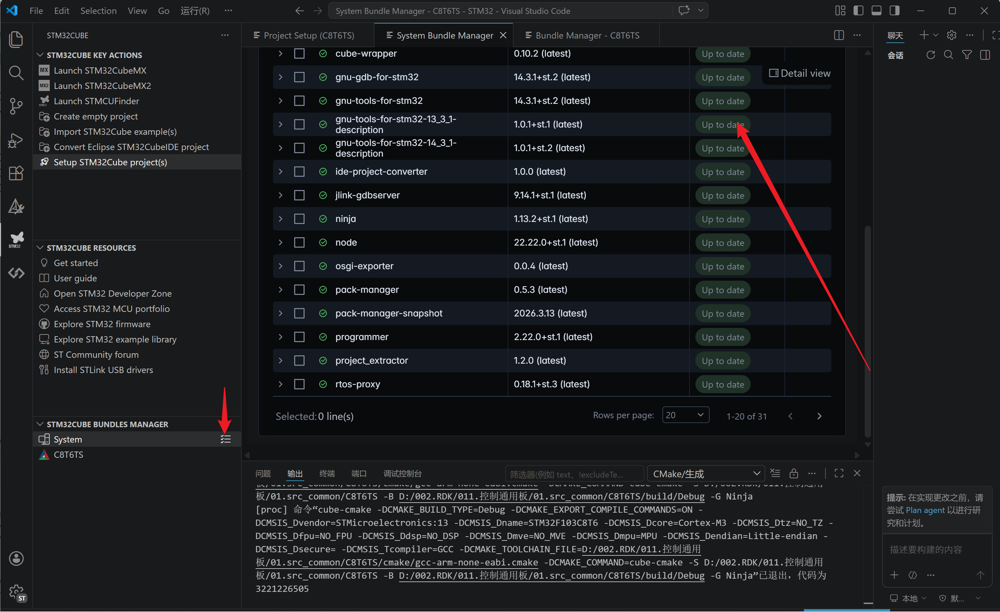

工程编译环境：

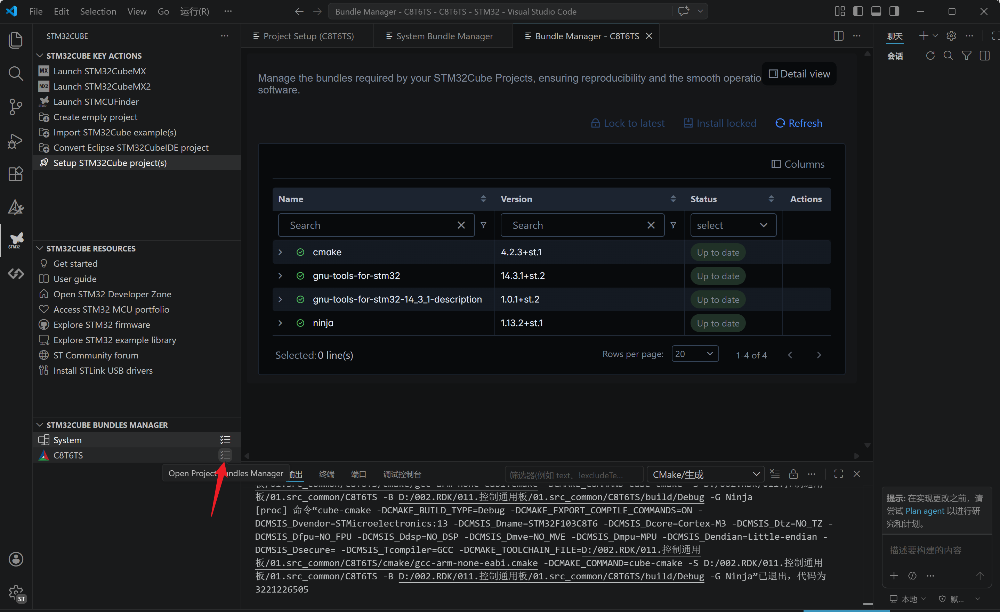

根据自己的需要，配置编译环境。

3. 编译工程
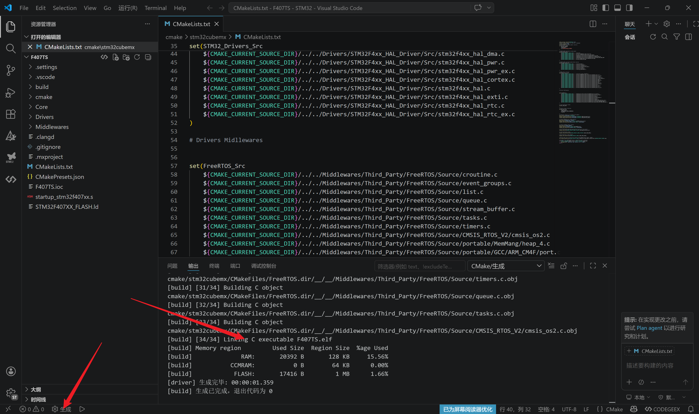


编译完成。


## 总结：
1.CubeMX生成的工程，在ubuntu 环境下，放在家目录下，编译正常。
2.Setup STM32Cube project(s)的错误问题原因是，
windows环境下，代码目录路径不能太长，不能有中文。
3.为什么使用CMD打开VSCode,是为了VSCode的终端可以继承，CMD的环境变量。
编译工具链的目录在`C:\Users\XXXX\AppData\Local\stm32cube\bundles\gnu-tools-for-stm32\13.3.1+st.9\bin`。
将此目录放到环境变量中。

完毕， 2026-05-01。


