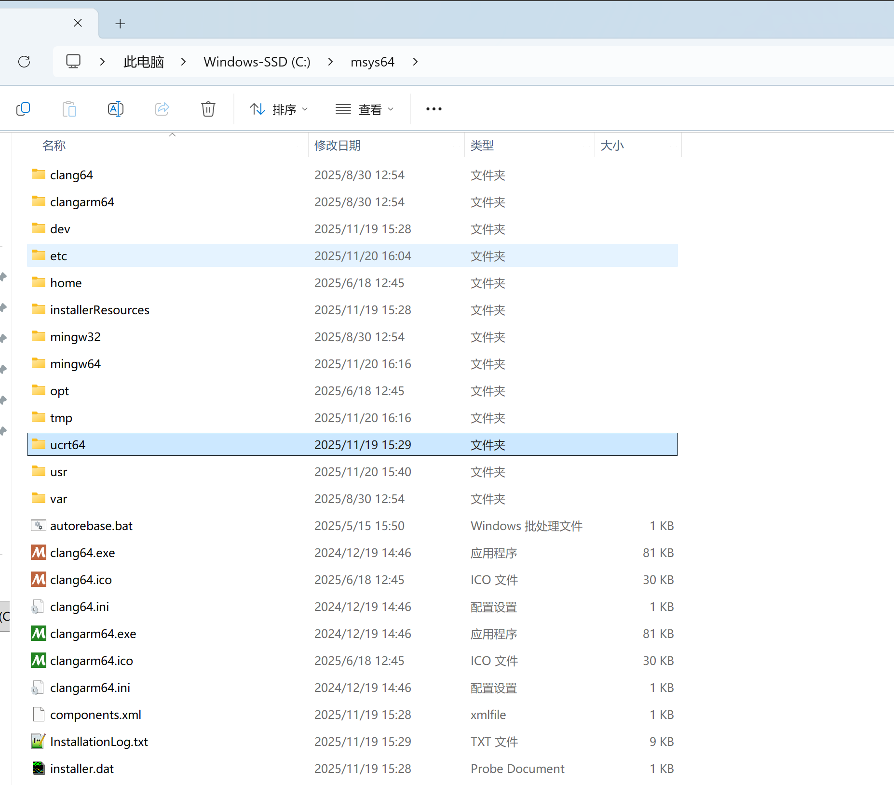
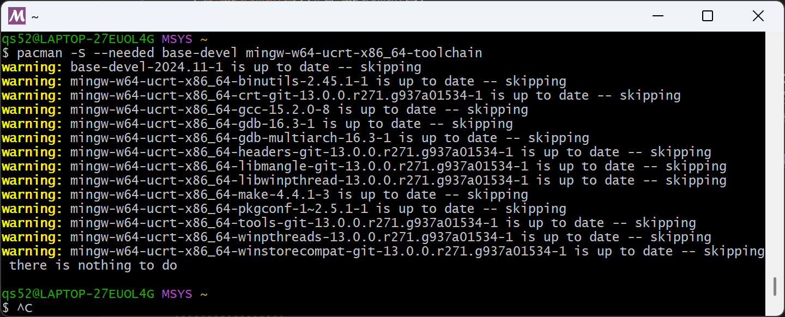
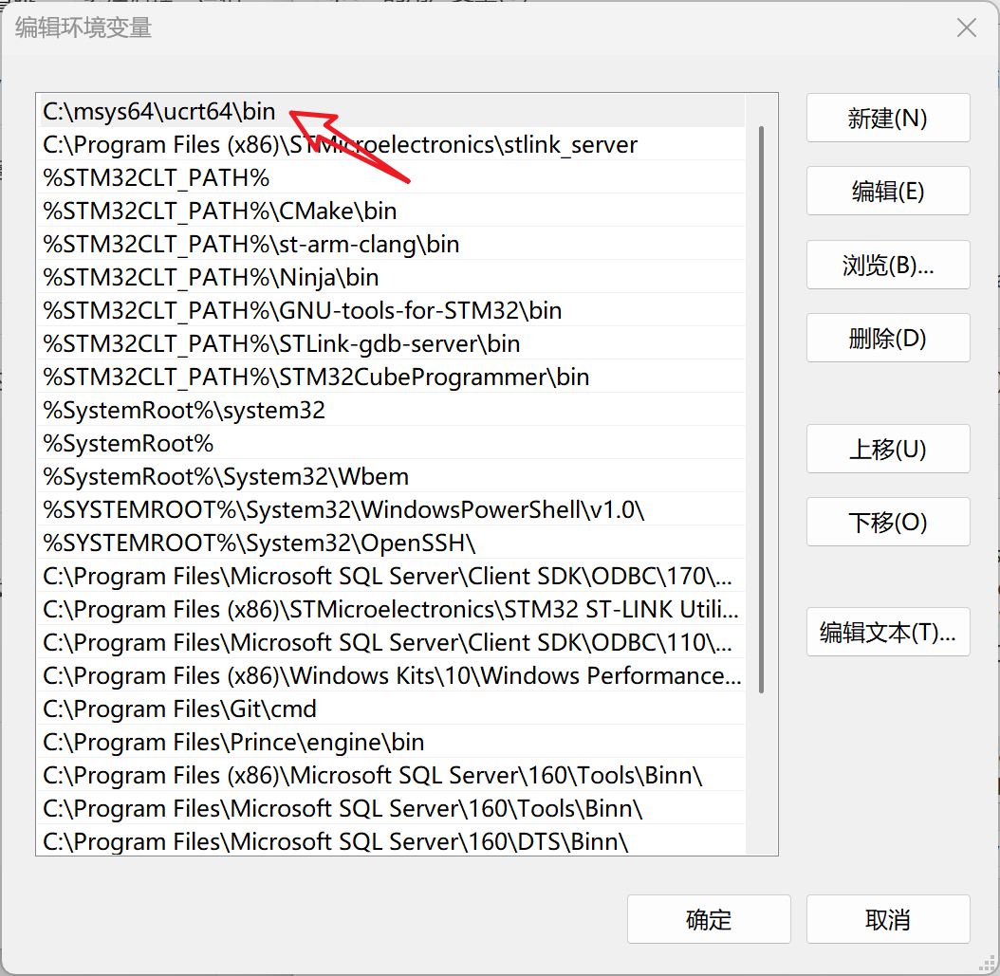
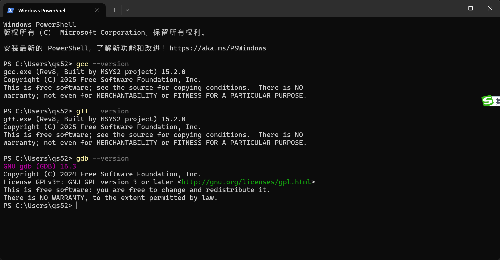

- [什么是MinGW](#什么是mingw)
- [MinGW-W64下载地址：](#mingw-w64下载地址)
- [本地环境：](#本地环境)
- [安装目录：](#安装目录)
- [管理pacman包](#管理pacman包)
- [环境变量：](#环境变量)
- [运行GCC，验证安装是不是成功。](#运行gcc验证安装是不是成功)


# 什么是MinGW
MinGW (Minimalist GNU for Windows) 是一种用于开发原生 Windows 应用的最小化 GNU 开发环境，可以理解为开发 Windows 程序的 gcc，也就是说这个gcc就是专门编译出能在windows平台运行的程序的编译器。MinGW 本身并不一定要运行在 Windows 下，Linux 上也可以通过 MinGW 工具链交叉编译 Windows 程序。

MSYS (Minimal SYStem) 是一系列 GNU 工具（bash、make、gawk、grep等）的集合（基于旧版 Cygwin），用于弥补 Windows cmd shell 的不足，让 MinGW 在 Windows 上更便于使用。

# MinGW-W64下载地址：
[https://www.mingw-w64.org/downloads/](https://www.mingw-w64.org/downloads/)

# 本地环境：
1. windows 11
2. 选用的工具是Msys2  [Msys2下载地址](https://www.msys2.org/)


# 安装目录：
本地C盘：`C:\msys64`


# 管理pacman包
```
pacman -S --needed base-devel mingw-w64-ucrt-x86_64-toolchain
```



# 环境变量：
右点开始菜单---> "系统"--新窗口中找到“高级系统信息”点击--->弹出"系统信息"窗口--->"高级"---> "环境变量(N)..."---> 修改"PATH"



# 运行GCC，验证安装是不是成功。



安装完成。

the end!!

