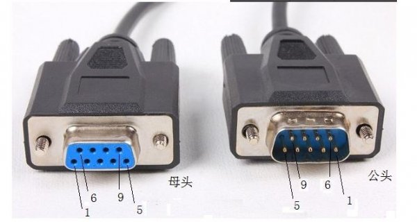
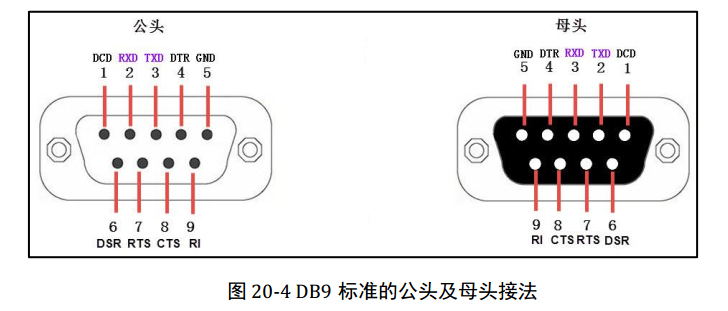
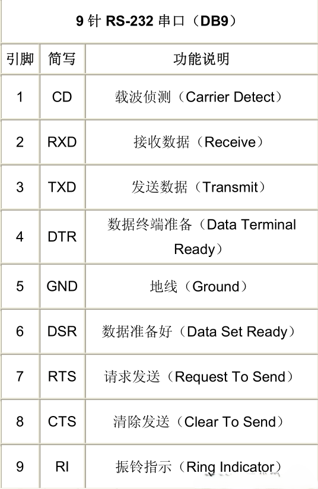

# DB9串口定义
基础——DB9九孔母头、九针公头 （RS232）接口定义

# 1. 公母头
公头和母头长什么样子？

# 2. 接口定义
每个引脚的定义如下：

# 3. 接口解释

# 4. 说明
一般，很多场合只用到2、3、5三个引脚；
RS232是全双工； 
  一般线束颜色，1-黑 2-红 3-棕 4-橙 5-黄 6-绿 7-蓝 8-紫 9-白 B: 1-黑 2-棕 3-红 4-橙 5-黄 6-绿 7-蓝 8-紫 9-白 ； 
RS232的逻辑1的电平（相对GND）是-3V~-15V，逻辑0的电平（相对GND）是+3V~+15V；
RS232 限于15米以内，理论传输距离是10米；

参考
[转自CSDN](https://blog.csdn.net/wangguchao/article/details/128479106)

the end